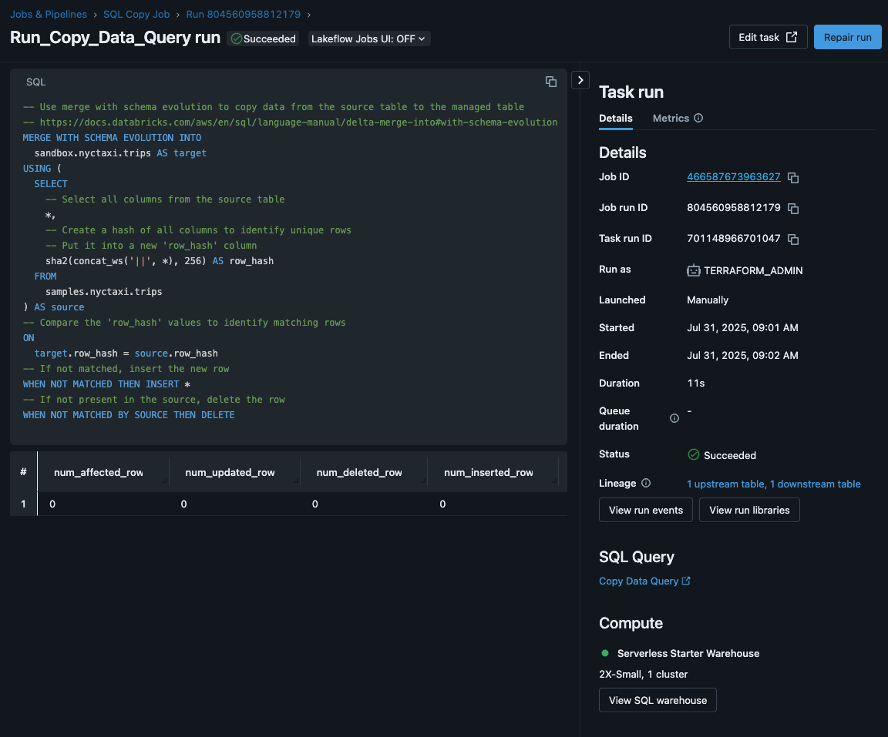

# databricks-demo-screenshots
This folder contains demonstration screenshots in order of execution.

### 00. Initial state

### 01. New table schema

### 02. New scheduled job

### 03. New scheduled job (details)

### 04. Initial scheduled run

### 05. Subsequent manual run

### 06. New table select

### 07. Python script run

### 08. Updated schedule

### 09. Final job state

